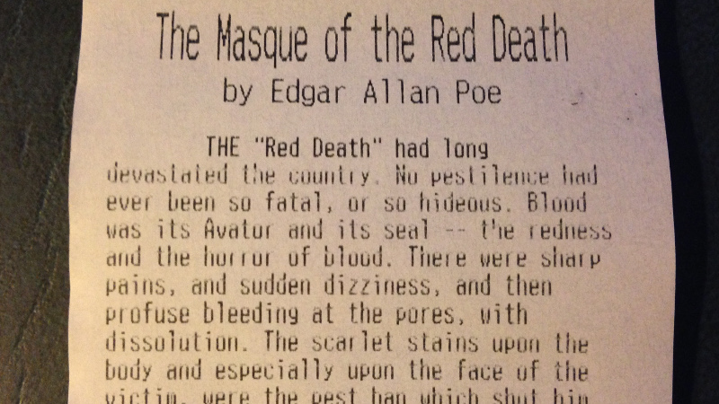
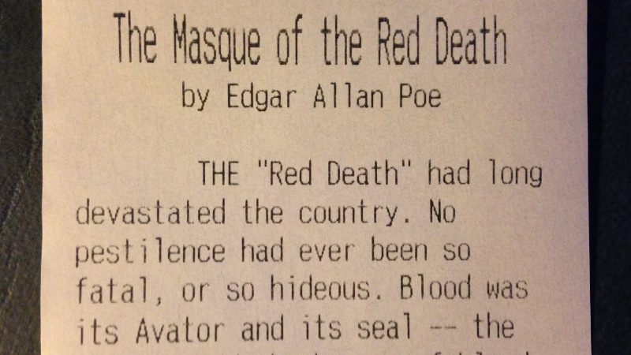

tptxt
=====

Usage
-----

	usage: tptxt.py [-h] [--verbatim] [--save PATH] [--dump] [--print]
					[--copies N] [--limit MAX] [--size {small,medium}]
					INPUT
	
	Prepare a text file for receipt printer.
	
	positional arguments:
	  INPUT                 Path to input text file.
	
	optional arguments:
	  -h, --help            show this help message and exit
	  --verbatim            Assume input text is pre-formatted.
	  --save PATH           Write formatted text to FILE.
	  --dump                Write formatted text to stdout.
	  --print               Send output to printer.
	  --copies N            Print N copies.
	  --limit MAX           Send output to printer only if total estimated length
							< MAX.
	  --size {small,medium}
							Body font size.

Examples
--------

	./tptxt.py txt/masque-original.txt --size small --save txt/masque-small.txt --print
	> Estimated document length: 943 mm (37.1 inches or 3.09 feet)

This command wraps the [input text](txt/masque-original.txt) to 42 characters per line using the default `small` font. The [output](txt/masque-small.txt) looks like this:

 
 For comparison, here the same text is printed using the `medium` font:

	./tptxt.py txt/masque-original.txt --size medium --save txt/masque-medium.txt --print
	> Estimated document length: 1902 mm (74.9 inches or 6.24 feet)

In this case, the [output](masque-medium.txt) is wrapped to 32 characters per line. It looks like this:

